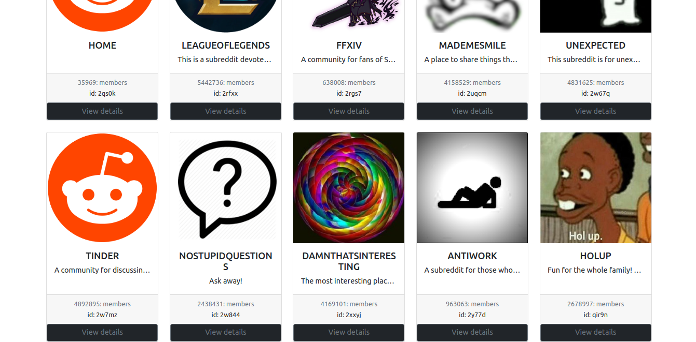
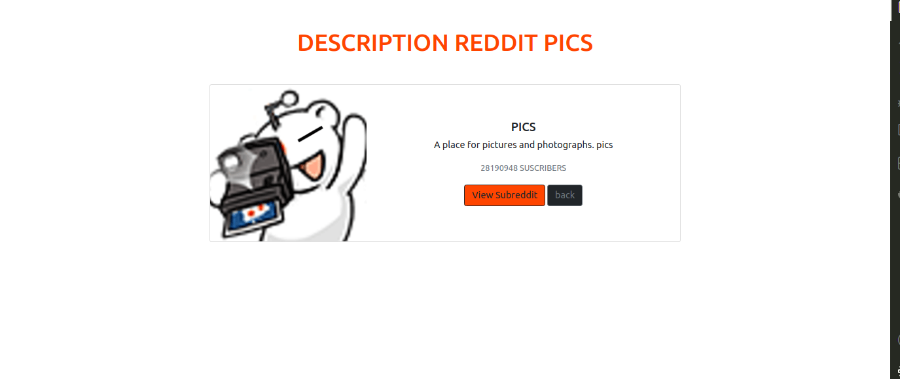

# APP REDDITS

Application that shows cards taking data from a mysql DB.

Using: node.js, mysql, ejs template manager, Bootstrap4.

---
## Main view with all reddits

---
## Details from a reddit

